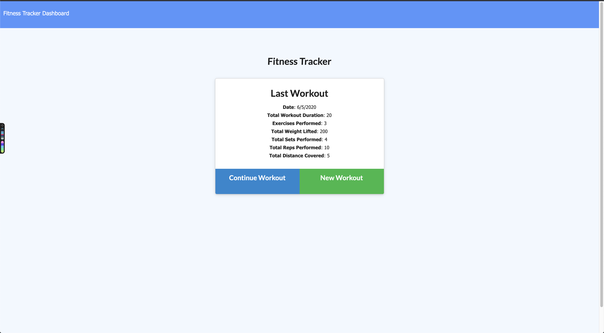
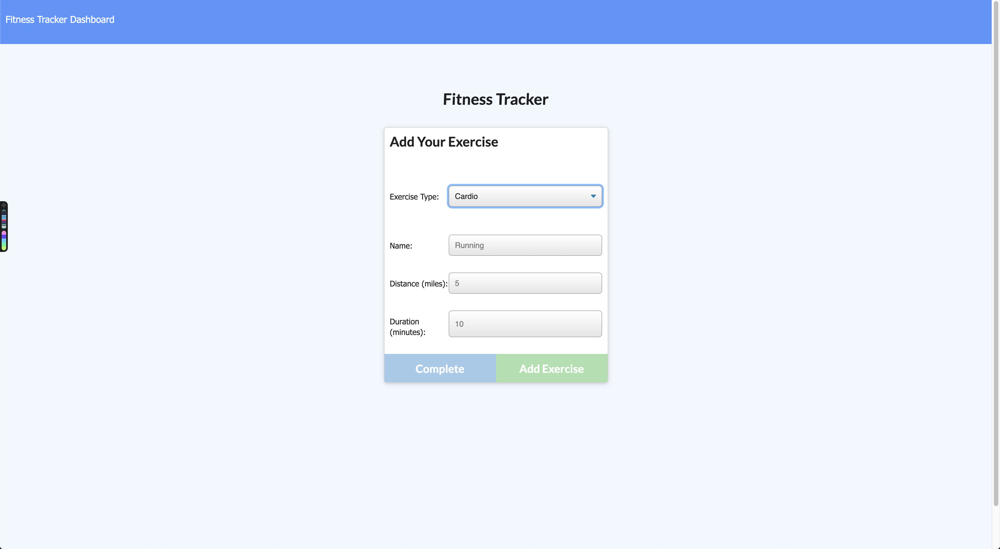
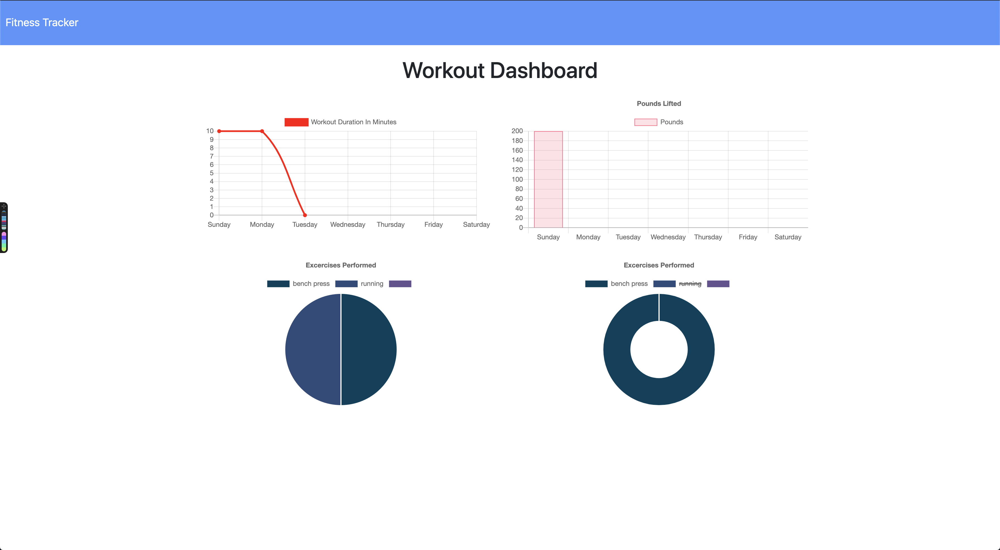

# fitnessTracker

   

## Description

fitnessTracker is an app which allows the user to add workouts to a database and view a summary of the last seven days.

The app uses the database containing workout objects. Each workout object contains an array of excercises.

Clicking on either of these buttons will direct the user to the exercise creation page. An exercise may be either "cardio" or "resistance," and the app prompts the user for different information depending on the choice

When all required information has been entered, the user may add a new exercise to the workout or finish and return to the home page.

By clicking on the Fitness Tracker Dashboard icon on the top of the page, the user is directed to the Stats page which displays graphs summarizing the last seven Workouts.

## 🚀 How to Use?

Click on the link https://calm-journey-28292.herokuapp.com/

## 🤝 Contributing

Contributions, issues and feature requests are welcome. 
[Check the contributing guidelines] 

## Author

👤 **Max Semegen**

## 📝 License

Copyright © 2020 [Max Semegen](https://github.com/Maxsem4). 
This project is 

\_This README was generated with ❤️ by Max Semegen
